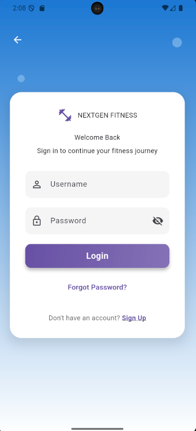
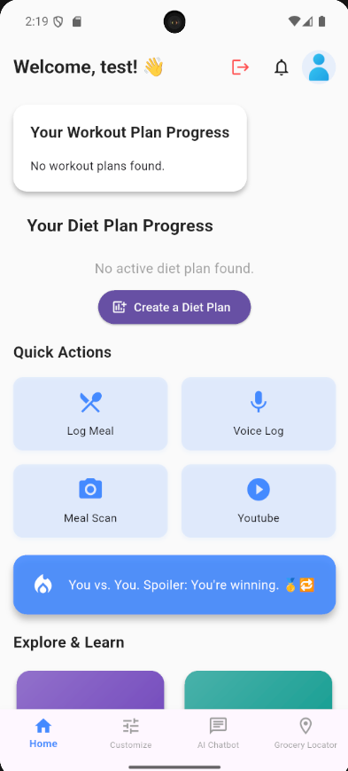
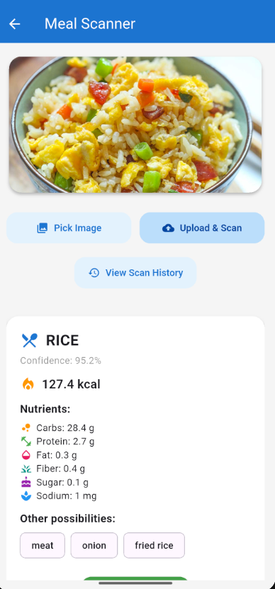
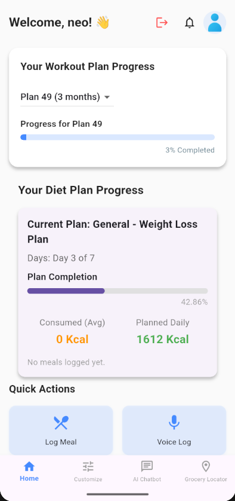
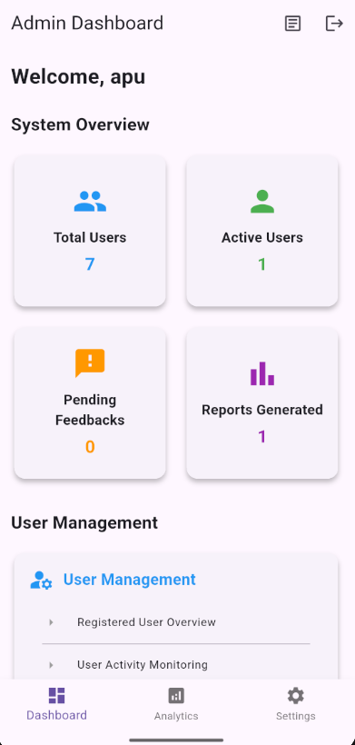

# 🏋️‍♂️ Capstone Project – NextGen Fitness

**An AI-powered fitness companion that provides personalized workout and diet plans, real-time meal scanning, chatbot support, and detailed analytics – all in one app.**

---

## 📱 Overview

**NextGen Fitness** is a full-stack health and fitness application designed to help users achieve their wellness goals with the power of AI and automation.

It features:
- AI-generated diet and workout plans
- Camera-based food recognition
- Daily progress tracking
- Chatbot assistant for health guidance
- Admin dashboard with system analytics

---

## 🖼️ Screenshots
### 🔐 Login Screen


### 🧑‍💻 User Dashboard


### 🥗 Meal Scanner


### 📈 Progress Analytics


### 👨‍💼 Admin Panel


---

## 🔧 Tech Stack

| Layer    | Technology                               |
|----------|-------------------------------------------|
| Frontend | Flutter (Android)                         |
| Backend  | Flask, SQLite, RESTful API                |
| AI/ML    | Image processing, Google AI tools         |
| Tools    | Git, VS Code, Android Emulator   |

---

## 🚀 Getting Started

### ✅ Backend Setup

```bash
cd backend
pip install -r requirements.txt
python NextGenFitness.py
```

### ✅ Frontend Setup

```bash
cd frontend
flutter pub get
flutter run
```

> ⚠️ Make sure the backend server is running before launching the mobile app.

---

## 📖 Features

- 📋 **Custom Diet & Workout Plans**  
- 🤳 **AI-powered Meal Recognition**  
- 📊 **Progress & Goal Tracking**  
- 💬 **Chatbot Fitness Assistant**  
- 🔒 **Admin Management Interface**

---

## 📂 Project Structure

```
Capstone-project/
│
├── backend/             # Flask server and API routes
├── frontend/            # Flutter mobile app
├── screenshots/  # Screenshots for documentation
└── README.md
```

---

## 🎓 What I Learned

- Full-stack app development using Flutter and Flask  
- REST API creation and integration  
- AI integration for health tech  
- Building real-world user flows and system dashboards  
- Collaborating on capstone projects with version control

---

## 📬 Contact

Feel free to connect or reach out for questions, collaborations, or internships!

- 📧 Email: jayveeong0205@gmail.com  
- 🌐 GitHub: [jayveeong05](https://github.com/jayveeong05)  

---

> 🙌 *This project was built as part of a final year capstone. Special thanks to the team members and mentors who made it possible!*
